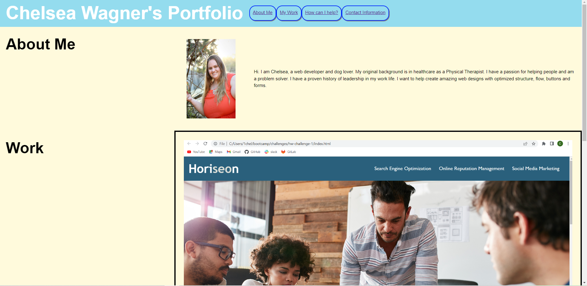

# Chelsea Wagner's Portfolio

# Description
    -This project involved developing a Portfolio for Chelsea Wagner.
    -The project includes the sections About Me, Work, How to Reach Me, and Contact information.
    -The project focused on semantic HTML and more indepth usage of CSS including flexbox and responsive design.
    
# Installation

    Follow the following URL to the website: https://caf62219.github.io/chelsea-wagner-portfolio/

# Usage

   
- You can click on the links at the top to navigate the webpage.
- If you hover over the Show Contact Information the contact information appears

# Credits
    Donnie Rawlings: https://github.com/drawlin22/HW-Module-1

# License
    MIT
